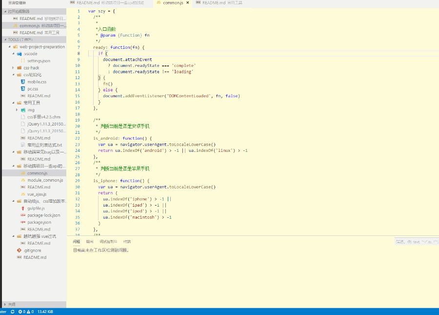

# 常用工具

## 网站

### <a href="https://developer.mozilla.org/zh-CN/" target="_blank">MDN</a>

---

### <a href="http://css.doyoe.com/" target="_blank">css 参考手册</a>

---

### <a href="http://hemin.cn/jq/" target="_blank">JQ 参考手册</a>

---

### <a href="https://github.com/paddingme/Learning-HTML-CSS/issues/17" target="_blank">emmet 语法</a>

---

### <a href="http://www.cnblogs.com/zxin/archive/2013/01/26/2877765.html" target="_blank">常用正则表达式</a>

---

### <a href="https://jeasonstudio.gitbooks.io/vscode-cn-doc/content/md/%E6%89%A9%E5%B1%95/%E6%A6%82%E8%BF%B0.html" target="_blank">vscode 中文文档</a>

---

### <a href="http://www.cnblogs.com/PeunZhang/p/5553574.html" target="_blank">npm 常用命令</a>

---

### <a href="https://shd101wyy.github.io/markdown-preview-enhanced/#/zh-cn/markdown-basics" target="_blank">markdown 语法</a>

---

### <a href="http://www.ruanyifeng.com/blog/2015/12/git-cheat-sheet.html" target="_blank">常用 git 命令</a>

---

### 如何从 jq 过渡到原生 js

<a href="http://youmightnotneedjquery.com/#trigger_custom" target="_blank">You might not need jquery</a>

---

### <a href="http://idea.lanyus.com/" target="_blank">IDE 注册码(你可用的是 webstorm？)</a>

---

### <a href="http://keycode.info/" target="_blank">获取键盘码</a>

---

### css3 动画不会写咋办？

<a href="https://www.w3cways.com/css3-animation-tool" target="_blank">css3 简单动画工具</a>

---

### <a href="http://www.jb51.net/onlineread/htmlchar.htm" target="_blank">html5 特殊字符编码对照表</a>

---

### <a href="https://tinypng.com/" target="_blank">图片在线压缩</a>

---

### <a href="https://spritegen.website-performance.org/" target="_blank">在线制作精灵图</a>

---

### <a href="https://segmentfault.com/a/1190000002407912" target="_blank">常用 meta 整理</a>

---

## 谷歌插件

### <a href="https://chrome.google.com/webstore/detail/chrono-download-manager/mciiogijehkdemklbdcbfkefimifhecn" target="_blank">Chrono 下载管理器</a>

集下载管理、资源嗅探于一身

---

### <a href="https://chrome.google.com/webstore/detail/markdown-reader/gpoigdifkoadgajcincpilkjmejcaanc" target="_blank">Markdown Reader</a>

MD 文档阅读工具

---

### <a href="https://chrome.google.com/webstore/detail/allow-control-allow-origi/nlfbmbojpeacfghkpbjhddihlkkiljbi" target="_blank">Allow-Control-Allow-Origin: \*</a>

跨域请求解除限制

---

### <a href="https://chrome.google.com/webstore/detail/take-webpage-screenshots/mcbpblocgmgfnpjjppndjkmgjaogfceg" target="_blank">捕捉网页截图 - FireShot</a>

---

## 打造最强编辑器，vscode 插件

### <a href="https://marketplace.visualstudio.com/items?itemName=formulahendry.auto-rename-tag" target="_blank">Auto Rename Tag</a>

自动重新命名配对的 HTML / XML 标签


---

### <a href="https://marketplace.visualstudio.com/items?itemName=mrmlnc.vscode-autoprefixer" target="_blank">Autoprefixer</a>

解析 CSS 并自动添加供应商前缀。


---

### <a href="https://marketplace.visualstudio.com/items?itemName=mrcrowl.easy-less" target="_blank">Easy LESS</a>

保存时自动编译 LESS 到 CSS

---

### <a href="https://marketplace.visualstudio.com/items?itemName=dbaeumer.vscode-eslint" target="_blank">ESlint</a>

代码规范检查，将 ESLint 集成到 VS 代码中。

---

### <a href="https://marketplace.visualstudio.com/items?itemName=mkaufman.HTMLHint" target="_blank">HTMLHint</a>

用于 HTMLHint 的 VS 代码集成 - 用于 HTML 的静态代码分析工具

---

### <a href="https://marketplace.visualstudio.com/items?itemName=ritwickdey.LiveServer" target="_blank">Live Server</a>

为静态和动态页面启动具有实时重新加载功能的开发本地服务器
像 webstorm、hbuilder 一样甚至更强的本地服务器，支持热更新。


---

### <a href="https://marketplace.visualstudio.com/items?itemName=shd101wyy.markdown-preview-enhanced" target="_blank">Markdown Preview Enhanced</a>

Markdown 实时预览


---

### <a href="https://marketplace.visualstudio.com/items?itemName=HookyQR.minify" target="_blank">minify</a>

使用命令进行 html、css、js 压缩混淆，并（可选）在保存时重新缩小。


---

### <a href="https://marketplace.visualstudio.com/items?itemName=christian-kohler.path-intellisense" target="_blank">Path Intellisense</a>

自动完成文件名路径


---

### <a href="https://marketplace.visualstudio.com/items?itemName=esbenp.prettier-vscode" target="_blank">Prettier - Code formatter</a>

代码格式化插件

---

### <a href="https://marketplace.visualstudio.com/items?itemName=nonoroazoro.syncing" target="_blank">Syncing</a>

将每个设置与您自己的 GitHub Gist 同步。

## gulp 插件

---

### <a href="http://www.softpedia.com/get/Compression-tools/WinGZip.shtml/" target="_blank">gzip</a>

gzip 压缩神器

更强的 gulp 版，可以批量压缩
[gulp-gzip](https://www.npmjs.com/package/gulp-gzip)

简单的 gulp-file 配置:

```js
var gulp = require('gulp')
var gzip = require('gulp-gzip')
gulp.task('gzip', function() {
  gulp
    .src('./lib/*.*')
    // 大于10kb的才压缩
    .pipe(gzip({ threshold: 10240 }))
    .pipe(gulp.dest('./dist'))
})
```

### <a href="https://weflow.io/" target="_blank">weflow</a>

_一个高效、强大、跨平台的前端开发工作流工具_

功能特性:

- 自动化流程
  - Less / Sass -> CSS 编译
  - CSS Autoprefixer 前缀自动补全
  - 自动生成图片 CSS 属性，width & height 等
  - CSS cssnano 压缩
  - CSS Sprite 雪碧图合成
  - Retina @2x & @3x 自动生成适配
  - Imagemin 图片压缩
  - JS 合并压缩
  - EJS 模版语言
- 调试 & 部署
  - 监听文件变动，自动刷新浏览器 (LiveReload)
  - S/FTP 发布部署
  - Zip 项目打包
- 解决方案集成
  - px -> rem 兼容适配方案
  - 智能 WebP 解决方案
  - 去缓存文件 Reversion (MD5) 解决方案
